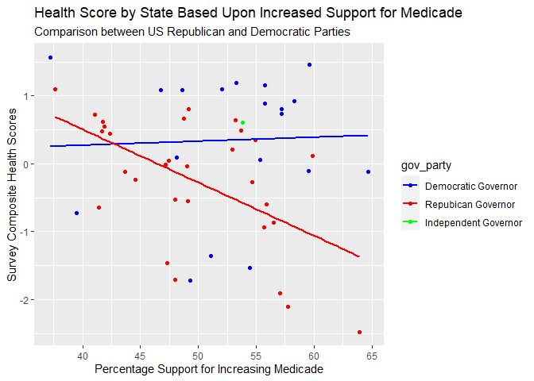
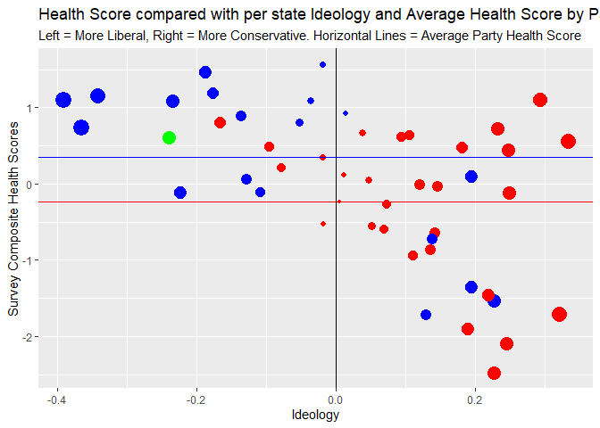

Mod 5 Quickfire
================
Dr. Cassy Dorff
2022-09-20

## Healthcare Outcomes, Perceptions, & Political Ideology

The data set `health` has several variables capturing the health
outcomes and politics of U.S. states, such as the infant mortality rate
and percent of the population that have a favorable attitude toward the
Affordable Care Act.

## Data dictionary

To read brief descriptions about the individual variables, see the data
dictionary markdown file on github.

## Your task: explore the data

-   Be clear.
-   Use R programming only (no python or excel).
-   At a minimum aim for two well developed, original different data
    visualizations (use two different graphical presentations of the
    data). Avoid making a map.
-   Interpret your findings.
-   You are *not* allowed to work with other students but you *can* ask
    me questions.
-   Do not cheat and find examples of these data used online. Firstly,
    that should be rather difficult and will waste your time. Secondly,
    be original!
-   You *must* push your work in an .rmd file to github in your
    *assignments* repo
-   You *must* also knit to MD flavored github doc and push this to
    github too.
-   You can edit this document however you want or make your own RMD to
    use.

## Points

Do not fret! This is not a big percentage of your grade.

-   This is worth 10 points (equivalent of 1 hw) which go into the
    “participation, quizzes, and assignments” category of your
    gradebook.
-   5 points = demonstrated effort but incomplete submission
-   6-8 points = good work, meets expectations, but with some room for
    improvement.
-   10 points = terrific job, exceeds expectations, little room for
    improvement.

There are also prizes.

``` r
health = read.csv("quickfire_data.csv")
dim(health)
```

    ## [1] 50 17

``` r
lapply(health, class)
```

    ## $state
    ## [1] "character"
    ## 
    ## $state_abbr
    ## [1] "character"
    ## 
    ## $gov_party
    ## [1] "character"
    ## 
    ## $sen_party
    ## [1] "character"
    ## 
    ## $house_party
    ## [1] "character"
    ## 
    ## $percent_favorable_aca
    ## [1] "numeric"
    ## 
    ## $percent_supporting_expansion
    ## [1] "numeric"
    ## 
    ## $obama_12
    ## [1] "numeric"
    ## 
    ## $ideology
    ## [1] "numeric"
    ## 
    ## $percent_uninsured
    ## [1] "integer"
    ## 
    ## $infant_mortality_rate
    ## [1] "numeric"
    ## 
    ## $cancer_incidence
    ## [1] "numeric"
    ## 
    ## $heart_disease_death_rate
    ## [1] "numeric"
    ## 
    ## $life_expectancy
    ## [1] "numeric"
    ## 
    ## $leg_party
    ## [1] "character"
    ## 
    ## $health_score
    ## [1] "numeric"
    ## 
    ## $health_score_cat
    ## [1] "character"

``` r
head(health)
```

    ##        state state_abbr           gov_party         sen_party      house_party
    ## 1    Alabama         AL  Repubican Governor Republican Senate Republican House
    ## 2     Alaska         AK  Repubican Governor Republican Senate Republican House
    ## 3    Arizona         AZ  Repubican Governor Republican Senate Republican House
    ## 4   Arkansas         AR Democratic Governor Republican Senate Republican House
    ## 5 California         CA Democratic Governor Democratic Senate Democratic House
    ## 6   Colorado         CO Democratic Governor Democratic Senate Democratic House
    ##   percent_favorable_aca percent_supporting_expansion obama_12   ideology
    ## 1               38.2711                      57.7616  38.7838  0.2440440
    ## 2               37.4428                      47.4247  42.6847  0.0472331
    ## 3               39.6722                      53.2125  45.3866  0.1048640
    ## 4               36.1624                      54.4381  37.8456  0.2267410
    ## 5               56.0999                      53.2616  61.8728 -0.1766000
    ## 6               45.0012                      58.3102  52.7480  0.0142283
    ##   percent_uninsured infant_mortality_rate cancer_incidence
    ## 1                14                   9.2            472.9
    ## 2                19                   6.5            451.4
    ## 3                18                   6.4            387.1
    ## 4                18                   7.6            426.7
    ## 5                19                   5.1            434.0
    ## 6                15                   6.2            430.0
    ##   heart_disease_death_rate life_expectancy                      leg_party
    ## 1                    236.0            75.4 Unified Republican Legislature
    ## 2                    151.5            78.3 Unified Republican Legislature
    ## 3                    146.7            79.6 Unified Republican Legislature
    ## 4                    222.5            76.0 Unified Republican Legislature
    ## 5                    161.9            80.8 Unified Democratic Legislature
    ## 6                    132.8            80.0 Unified Democratic Legislature
    ##   health_score health_score_cat
    ## 1   -2.0999900   Bottom Tercile
    ## 2    0.0484103   Middle Tercile
    ## 3    0.6444630      Top Tercile
    ## 4   -1.5388800   Bottom Tercile
    ## 5    1.1934900      Top Tercile
    ## 6    0.9248680      Top Tercile

``` r
plot1 = ggplot(health, aes(x=percent_supporting_expansion, y=health_score)) +
  labs(title="Health Score by State Based Upon Increased Support for Medicade",
       subtitle = "Comparison between US Republican and Democratic Parties", x = "Percentage Support for Increasing Medicade", y = "Survey Composite Health Scores") +
  geom_jitter(aes(col=gov_party)) +
  scale_color_manual(values = c("Democratic Governor" = "blue", "Repubican Governor" = "red", "Independent Governor" = "green")) +
  geom_smooth(aes(col=gov_party), method="lm", se=F)
plot1
```

    ## `geom_smooth()` using formula 'y ~ x'

<!-- --> The
above graph attempts to find a correlation between support for
increasing Medicade coverage and the health levels by state and by
governor party affiliation. It is apparent by the dispersion of the
points across the graph that there is little correlation between the
variables. That being said, from the trend line shown for the Republican
Governor states, it may be inferred that as the health score of the
state decreases, the support for Medicade is increased. This is likely
due to the population of states with poor public health infrastructures
believing that it may be in their interest to implement a federal health
system.

``` r
demAvg = health %>% filter(gov_party == "Democratic Governor") %>% summarise(mean(health_score))
demAvg = demAvg[1,1]

repAvg = health %>% filter(gov_party == "Repubican Governor") %>% summarise(mean(health_score))
repAvg = repAvg[1,1]

plot2 = ggplot(health, aes(x=ideology, y=health_score)) +
  labs(title="Health Score compared with per state Ideology and Average Health Score by Party",
       subtitle = "Left = More Liberal, Right = More Conservative. Horizontal Lines = Average Party Health Score", x = "Ideology", y = "Survey Composite Health Scores") +
  geom_point(aes(x=ideology, y=health_score, col=gov_party, size=abs(ideology)), show.legend = FALSE) +
  scale_color_manual(values = c("Democratic Governor" = "blue", "Repubican Governor" = "red", "Independent Governor" = "green")) + geom_hline(yintercept=demAvg, color= "blue") + geom_hline(yintercept=repAvg, color= "red") + geom_vline(xintercept = 0)
plot2 
```

<!-- --> The
above graph analyzes how Ideology is correlated with the health score of
the state. The graph shows that the more liberal a state is, the higher
its health score. This can be seen by the average party health scores
and that the blue states which lean conservative almost have all of the
lowest health scores among blue states.
